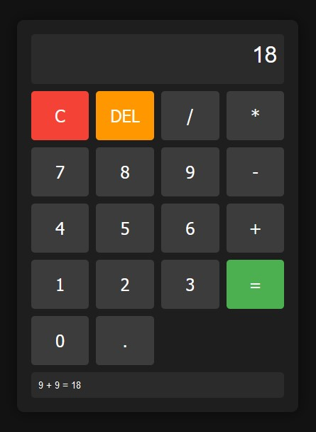

# Simple Calculator Web Application

This is a simple and user-friendly calculator web application built using HTML, CSS, and JavaScript. The calculator performs basic arithmetic operations and displays a history of operations at the bottom.



## Features

- **Basic Arithmetic Operations**: Addition, subtraction, multiplication, and division.
- **Clear and Delete**: Clear the entire input or delete the last digit entered.
- **History Display**: Displays the history of calculations at the bottom of the calculator interface.

## Project Structure

The project directory is structured as follows:

```
calculator-web
├── css
│   └── styles.css
├── js
│   └── script.js
├── screenshot
│   └── screen.jpg
└── index.html
```

## Files Description

- **index.html**: The main HTML file that sets up the structure of the calculator interface.
- **css/styles.css**: The CSS file that styles the calculator, making it look visually appealing and user-friendly.
- **js/script.js**: The JavaScript file that adds functionality to the calculator, handling user inputs and performing calculations.
- **screenshot/screen.jpg**: A screenshot of the calculator interface for reference.

## How to Run

1. Clone the repository to your local machine:
   ```bash
   git clone https://github.com/AlexsanderMe/calculator-web.git
   ```

2. Navigate to the project directory:
   ```bash
   cd calculator-web
   ```

3. Open the `index.html` file in your web browser to view and use the calculator.

## Usage

- **Number Buttons**: Click to input numbers.
- **Operation Buttons**: Click to perform addition (`+`), subtraction (`-`), multiplication (`*`), or division (`/`).
- **Equals Button (`=`)**: Click to evaluate the expression and display the result.
- **Clear Button (`C`)**: Click to clear the entire input.
- **Delete Button (`DEL`)**: Click to delete the last digit entered.
- **Decimal Button (`.`)**: Click to add a decimal point to the number.

## Screenshots

Here's how the calculator interface looks:


## Contributions

Contributions are welcome! Please fork the repository and submit a pull request for any improvements or bug fixes.

## License

This project is licensed under the MIT License. See the [LICENSE](LICENSE) file for more details.
